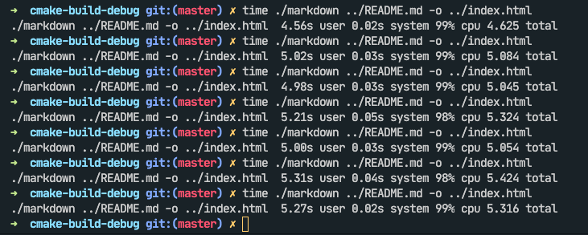
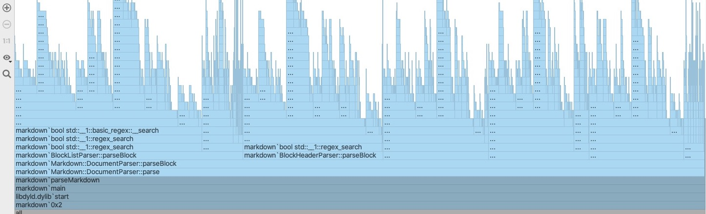

# Markdown编辑器/解析器

2020年春季学期《高级程序设计》第一次课程设计

计算机科学与技术系 171860508 张天昀

---

## 一、主要内容

本次实验的主要内容是设计一个Markdown编辑器/解析器，可以从标准输入或文件中读取Markdown内容，并将内容按照规定的语法翻译成HTML格式的文件并保存。

实验中解析Markdown的流程共分为三大部分：

1. 处理文件或字符流的读入、以及后续HTML文件的保存；
2. 将读入的Markdown字符流转换成对应的DOM节点；
3. 将DOM节点链接成DOM树，并递归输出成为HTML文档。

本文档即由该程序生成的HTML页面打印而得到，体现了程序所支持的不同功能。

整个工程的代码目录结构如下：

```
Markdown
├── CMakeLists.txt                      # CMake配置文件
├── README.md                           # 此文档
├── README.pdf                          # 此文档生成的PDF文件
├── index.html                          # 此文档生成的HTML文件
├── assets                              # 文档使用的一些图片
├── dist                                # 预编译的可执行文件
│   ├── markdown-windows-x64.exe        # gcc O2 静态编译
│   ├── markdown-linux-x64              # gcc O2 静态编译
│   └── markdown-darwin-x64             # clang O2
└── src
    ├── headers
    │   ├── common.h                    # 通用头文件（STL等）
    │   ├── dom.h                       # HTML标签枚举、DOM结点类声明
    │   ├── markdown.h                  # Markdown主解析器类声明
    │   ├── regex.h                     # 打包regex_search函数（见4.1节）
    │   └── parsers
    │       ├── abstract.h              # 抽象解析器
    │       ├── block                   # 各种块语法解析器
    │       │   ├── code.h
    │       │   ├── divider.h
    │       │   ├── header.h
    │       │   ├── list.h
    │       │   ├── paragraph.h
    │       │   └── table.h
    │       └── inline                  # 各种行语法解析器
    │           ├── code.h
    │           ├── header.h
    │           ├── hyperlink.h
    │           ├── image.h
    │           ├── italic.h
    │           ├── plain.h
    │           ├── strong-italic.h
    │           └── strong.h
    ├── main.cpp                        # 程序主入口、输入输出控制
    ├── dom.cpp                         # HTML标签名称、DOM结点类定义
    └── markdown.cpp                    # Markdown主解析器类定义
```

## 二、程序设计

### 2.1 Markdown解析逻辑

解析Markdown时，我们可以把语法分为两类：

- 块语法：如段落`<p>`、列表`<ol><ul>`、代码段`<pre>`等；
- 行语法：如加粗`<strong>`、链接`<a>`、图片``等。

一个块可能包含了多个行语法，但行语法中不会出现块语法。

因此，解析Markdown可以分两步走：首先将输入文本分割成不同大小的块，再处理每个块中的样式。而具体的在处理不同块、不同样式的判别时，我使用`<regex>`库和正则表达式来处理。

由此得到如2.2节所示的设计方案。

### 2.2 类的关系

```
      [AbstractParser] <-------------+            [HTML Document]
       DocumentParser                |                 *HTML
       /            \                |                 /   \
 BlockParsers   InlineParsers        |            *<head>  *<body>
  /    |    \    /    |    \         |                      /  \
 <p>  <ul> ...  <a>  <i>  ...        +-------------> DOM::Node *<script>
```

整个工程中有两个Namespace：分别是`Markdown`和`DOM`，对应Markdown解析器和HTML文档相关成员。

- `AbstractParser`是一个解析器基类，定义了调用解析器的两种接口。
  - `parseBlock`用于解析对应的段语法并生成、挂载DOM树结点；
  - `parseInline`用于解析对应的行内语法并生成、挂载DOM树结点。
- `DocumentParser`是主解析器类，其中有两个`vector`容器，按照指定的优先级分别存放了所有的块解析器和行解析器，在使用时按序进行判断，找到匹配成功的优先级最高的解析器，并调用解析函数（详见2.3-2.5节）。
- HTML文档对象模型（DOM）树是一棵多叉树，因此`DOM::Node`是一个多叉树结点类，保存了当前结点的标签、属性信息，以及挂载在当前结点下的子树列表（详见2.6节）。

### 2.3 解析器接口

上文所提到的两个解析器接口具有相同的使用方式：

```C++
protected:
    regex rule;
public:
    virtual size_t parseBlock(DOM::Node *, const char *, const size_t);
    virtual size_t parseInline(DOM::Node *, const char *, const size_t);
```

数据成员`rule`表示当前结点的正则表达式，可以通过正则表达式是否匹配来决定是否要按照此规则分析。

对于两个解析接口：

- `DOM::Node *parent`表示当前正在处理的DOM根节点，所有解析器需要将生成的新DOM树结点挂载到这个根节点上；而无需考虑根节点以外的内容。
- `const char *input`表示当前处理的Markdown字符串的头部指针。
- `const size_t size`表示当前处理的字符串的长度，这个变量主要用于debug时判断当前处理的字符串是否正确。实际上要求不管是传入的字符串，还是中间`match_results`生成的C风格字符串一定以`'\0'`结尾，这个参数略显多余。
- 函数的返回值表示处理成功的输入长度；当递归调用的长度总和大于等于当前字符串长度时，则代表解析成功结束。

当我们在创建一个解析器时，需要重载上面的任意一个接口，并定义我们的处理逻辑。如果我们不对某个接口重载，那么这个接口调用会直接返回`0`（这也是合理的，代表这个解析器接口什么都不干）。

如果解析器成功解析到了一个DOM子树，他就会将生成的子树挂载到根节点上，并返回此次调用解析成功的输入长度。例如，解析`[title](link)`后会将一个`<a href="link">title</a>`标签结点挂载到当前结点上，并告知调用者此次调用向前推进了13个字符。这样，解析器接口的使用者就可以将当前的位移增加13个字符大小，如果此时位移超过了总长度，则代表整段文本解析成功，返回解析的总长度。

### 2.4 主解析器

而对于主解析器`DocumentParser`来说，它也具有相同的接口，但它还具有额外的两个成员变量：

```C++
private:
    vector<AbstractParser *> blockParsers;
    vector<AbstractParser *> inlineParsers;
```

顾名思义，这两个`vector`容器分别代表主解析器中注册了的不同类型解析器的列表。主解析器的生命周期如下：

1. 在构造函数中，按照用户预先定义的优先级顺序创建并向两个`vector`容器中注入解析器。
2. 用户读入文本后，调用`parse`函数。
   - 此函数会创建一个`<main>`DOM结点，表示HTML正文部分的根节点。
   - `parse`函数会进一步调用`parseBlock`函数，不断循环并按照块解析器的优先级尝试解析，直到所有输入都被处理完毕。
   - `parse`函数将处理完毕后的`<main>`结点返回给用户，用户即可进一步组装HTML文档。
3. 在析构函数中，所有创建的解析器都会被销毁。

需要注意的是，在注入解析器时需要特别注意优先级，特别是在列表的最后需要放置一个防止死循环/解析失败的解析器。对于块解析器，`BlockParagraphParser`会将所有的行处理成一个`<p>`结点；对于行解析器，`InlinePlainParser`会在所有规则处理失败时吃掉第一个字符。

### 2.5 控制反转

BlockParser常常需要对行内文本进行处理。如果每个BlockParser都存储一个InlineParser列表，代码冗余度非常高。因此全局只有一个行解析器列表和全功能解析接口，即`DocumentParser::parseLine`函数。为了让BlockParser能够调用这个接口，我给抽象解析器添加了一个指针成员变量：

```C++
protected:
    AbstractParser *master{};
```

在所有的解析器的构造函数中注入指向主解析器的指针，这样就可以在解析一段文字的过程中通过指针调用行解析函数，得到当前结点下的一棵完整的DOM子树。

### 2.6 HTML文档对象模型树

DOM树结点的结构如下：

```C++
private:
    int indent{};
    enum Tags tag;
    string content;
    map<string, string> attrs;
    vector<Node *> children;
```

其中：

- `indent`表示当前节点层数，根节点`<main>`为二层。
- `tag`、`content`、`attrs`为节点的属性。
- `children`是指向当前结点子树的指针列表。

同时重载了`<<`运算符，使得一个结点可以直接以如下格式递归的输出到输出流中：

```HTML
        <tag attr1="value1" attr2="value2" ...>
            content
            <children1>
            <children2>
            ...
        </tag>
```

### 2.6 输出HTML文档

HTML文档的头部和尾部均为固定字符串，中间部分只需要利用重载了的`<<`运算符输出根节点即可。HTML的头部和尾部使用了如下的CSS样式表、JavaScript库：

- 页面样式：[Markdown-GitHub-CSS](https://github.com/sindresorhus/github-markdown-css)
- 代码高亮：[HighlightJS](https://highlightjs.org)
- 数学公式：[KaTeX](https://katex.org)

默认情况下，会创建一个`fstream`文件流并输入到文件，如果要输出到终端直接替换为`cout`即可。输出的HTML文档是带有缩进可以直接阅读的，并没有做minify处理。

## 三、程序使用

### 3.1 工程编译

工程使用CMake工具管理，配置使用`C++17`标准，对gcc和clang开启编译选项为`-Wall -Wextra`。

可以新建文件夹并使用`cmake`生成配置文件，然后编译。

```shell
$ mkdir build && cd build  # 也可使用Ninja或IDE等工具
$ cmake ../                # cmake ../ -G Ninja
$ make                     # ninja
$ ./markdown
```

### 3.2 命令行参数

运行时，如果没有给出命令行参数，则直接从标准输入流中读入Markdown字符串，并没有实现任意编辑功能。

```shell
cmake-build-debug git:(master) $ ./markdown 
No input file given, reading Markdown stream from console.
```

输入EOF（如bash中按下`Ctrl+D`）后，程序会将输入的Markdown字符串保存到当前目录下的`input.md`文件中，并生成HTML文档保存到`output.html`文件中。

如果运行时添加了参数，则会从文件中读入Markdown字符串，并输出到`output.html`或指定文件中。

```
Usage: markdown [-o output] input
E.g. ./markdown ../README.md -o ../index.html
     watch -n5 ./markdown keep-me-updated.md
```

### 3.3 Markdown语法

下面列举解析器头文件和对应的Markdown语法。

`parsers/inline/strong-italic.h`
`parsers/inline/strong.h`
`parsers/inline/italic.h`

粗体、斜体：采用非贪婪正则表达式匹配，总是先匹配最近的结束符号。

```markdown
**STRONG***ITALIC****STRONG AND ITALIC***
```

**STRONG***ITALIC****STRONG AND ITALIC***

---

`parsers/inline/strike.h`

删除线：用两个波浪符号括起来的文字~~看不见我~~

```markdown
~~strike out~~
```

~~strike out~~

---

`parsers/inline/code.h`

行内代码：

```markdown
`:(){ :|:& };:`
```

`:(){ :|:& };:`

---

`parsers/inline/hyperlink.h`

超链接：没啥特别的，超链接文本可以使用行内语法。

```markdown
Hyperlink to [*Tianyun's Home Page*](https://doowzs.com)!
```

Hyperlink to [*Tianyun's Home Page*](https://doowzs.com)!

---

图片：和超链接不同的是图片的文本并不会被渲染。（喜闻乐见的是，我VSCode安装的Markdown插件无法正确渲染下面这段代码）

```markdown
A red dot image $\rightarrow$ 

```

A red dot image $\rightarrow$ 


---

`parsers/block/header.h`

标题：`# H1`、`## H2`等

```markdown
# H1 *一级标题*
## H2 **二级标题**
### H3 ***三级标题***
```

# H1 *一级标题*

## H2 **二级标题**

### H3 ***三级标题***

---

`parsers/block/code.h`

代码段：使用三个"`"符号括起来的段落，可以跟语言名称，解析时会将语言名称或plaintext注入到对应的属性中。HTML文件中会使用HighlightJS库进行渲染。

---

`parsers/block/paragraph.h`

段落：独立成行即可。HTML文件中会使用$\KaTeX$库渲染数学公式。

```markdown
This is a paragraph `<p>` with Maths $y = x^2$, or $$y = x^2.$$
```

This is a paragraph `<p>` with Maths $y = x^2$, or $$y = x^2.$$

---

`parsers/block/divider.h`

分隔符：`---` 行首出现的三个或更多连续的dash符号

---

`parsers/block/list.h`

列表：分为有序列表`<ol>`和无序列表`<ul>`。嵌套列表时必须保证缩进空格数等于上一行空格数+标记长度，如果空格少了或者多了都会终止嵌套。

```markdown
- Unordered List 1
- Unordered List 2
  1. *Ordered* List 1
     * **Nested** Unordered List
  2. *Ordered* List 2
- Unordered List 3
```

- Unordered List 1
- Unordered List 2
  1. *Ordered* List 1
     * **Nested** Unordered List
  2. *Ordered* List 2
- Unordered List 3

---

`parsers/block/table.h`

表格：第一行为表头，第三行起为表内容。不支持文本左右对齐或居中。

```markdown
| Head 1     | Head 2   | Head 3 |
|------------|----------|--------|
| (1,1)      | (1, 2)   | (1, 3) |
| **Strong** | *Italic* | `code` |
```

| Head 1     | Head 2   | Head 3 |
|------------|----------|--------|
| (1,1)      | (1, 2)   | (1, 3) |
| **Strong** | *Italic* | `code` |

## 四、实验总结

### 4.1 遇到的问题

问题1：解析器无法正确处理多个行内样式紧密排列的情况，如

```markdown
**STRONG***ITALIC*
```

会被解析为："**STRONG* **" "ITALIC*"（匹配加粗的时候匹配到了后两个星号，斜体没了）

解决方案：使用非贪婪正则表达式，即将正则表达式改为`.*?`，表示匹配任意多个任意字符，最后的`?`表示尽可能少匹配。

---

问题2：处理一些特殊符号的时候会遇到问题，如小于号`<`、大于号`>`会被当成是HTML标签被浏览器渲染。

解决方案：在创建DOM结点时将这两个符号使用转义字符`&` `lt;`和`&` `gt;`替换。其他符号暂时没有遇到问题，没有特殊处理。

例如：

```markdown
You can input `#` to get `<h1>`.
```

You can input `#` to get `<h1>`.

---

问题3：解析Markdown的时间随文本输入快速增长。

例如，解析您正在浏览的`README.md`时，随着内容不断增多，写到这里的时候需要5秒以上的CPU时间。



通过CLion内置的profiler分析运行时间后发现如下的情况：

- `regex_search`函数占据了约90%的运行时间
- 但InlineParser调用的`regex_search`运行开销很小



经过各种控制变量~~玄学调试~~后发现，造成这种情况的原因是`regex_search`会尝试匹配所有可能的子串，而BlockParser的输入文本为Markdown全文，因此匹配的效率极其低下。

为了解决这个问题，做出了如下两处改进：

- ~~在进行正则表达式匹配前，先手动匹配第一个字符，如标题行第一个字符如果不是`#`，那就没有必要用正则表达式来匹配了。~~（由于这个改动很影响体验，后来被取消了，标题、分隔符、代码段仍然允许前置空格）
- 将正则表达式搜索的范围限制在一行以内
  - 添加文件`regex.h`，并实现了以下两个内容
  - `get_line_length`负责获取当前行的长度，也被BlockParagraphParser直接使用
  - `regex_search_line`把正则表达式搜索函数打包，然后用宏定义替换所有解析器中的调用

经过这两处修改后，渲染一次这个文件只需要0.4s左右。

### 4.2 实验感想

- 课程设计选题非常的开放，写起来**很爽**
- 写代码越写越停不下来（~~bug也越来越多~~）
- 能够理解为什么大型项目需要有code freeze了，必须要在某个时候强制停手
